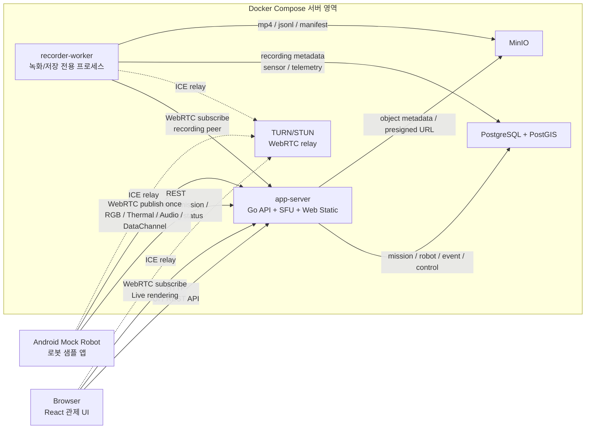
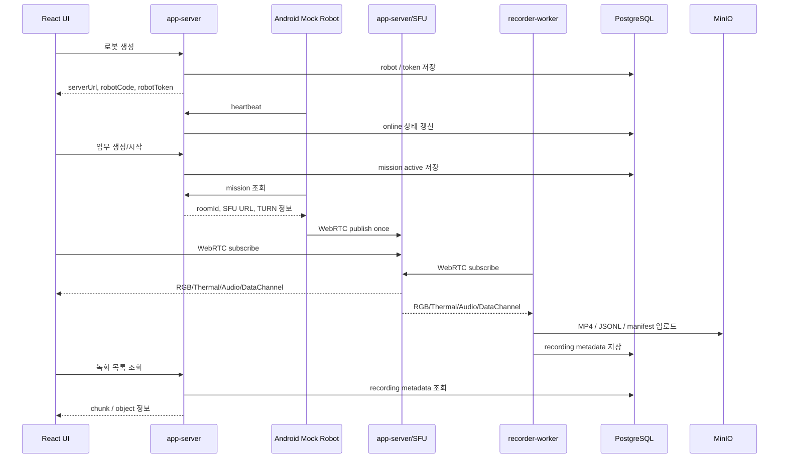

# Appendix. Architecture

## 1. 문서 목적

AI Web P0의 전체 런타임 구조, 구성요소 책임, Docker Compose 배치, WebRTC/SFU 연결, 저장 파이프라인을 정의한다.

본 문서는 `docs/ai-web-prd.md`의 아키텍처 상세 문서이다.

## 2. 아키텍처 방향

기존 PoC는 WebRTC 경로 검증을 위해 단일 목적 애플리케이션으로 작성되었다. P0 제품형 시스템은 서버를 과도하게 쪼개지 않고, `app-server`와 `recorder-worker` 중심으로 새로 작성한다.

핵심 방향:

- Android Mock Robot을 실제 Robot Gateway 샘플로 사용한다.
- `app-server`가 REST API, SFU signaling, SFU media fan-out, UI static serving의 기준점이다.
- `recorder-worker`는 저장 전용 프로세스로 분리한다.
- TURN은 WebRTC relay 인프라로 분리한다.
- PostgreSQL/PostGIS는 구조화 데이터와 위치 데이터를 저장한다.
- MinIO는 media/object 저장소로 사용한다.
- React UI는 관제 운영 화면을 담당하며, 배포 시 `app-server`에서 정적 파일로 제공할 수 있다.

## 3. 전체 구성



## 4. 주요 시퀀스



## 5. Docker Compose 기준

P0 서버 측 구성요소는 Docker Compose로 실행한다.

```text
docker compose up -d
docker compose down
```

Compose service 후보:

| Service | 책임 | 비고 |
| --- | --- | --- |
| `postgres` | 구조화 데이터, PostGIS 위치 데이터 | persistent volume |
| `minio` | media/object 저장 | persistent volume |
| `turn` | TURN/STUN relay | UDP 3478 |
| `app-server` | REST API, SFU signaling/media, auth, mission, robot, control, AI Agent, Web static serving | Go |
| `recorder-worker` | SFU subscriber, muxing, upload, metadata write | Go, app-server와 같은 repo/image 사용 가능 |

Android Mock Robot은 실제 Android 단말에서 실행하므로 compose service에 포함하지 않는다.

## 6. 구성요소 책임

### 6.1 Android Mock Robot

Android Mock Robot은 P0에서 Robot Gateway 샘플 역할을 한다.

책임:

- 관제센터 연결 정보 입력
- robotToken 기반 app-server API 호출
- heartbeat 송신
- active mission 조회
- app-server/SFU WebRTC publish
- RGB camera track 송신
- synthetic thermal track 송신
- microphone Opus audio track 송신
- sensor DataChannel 송신
- GPS telemetry DataChannel 송신
- streaming status 보고
- camera switch 같은 샘플 운영 기능 제공

P0에서는 Android Mock이 로봇 등록 자체를 생성하지 않는다. 로봇 생성은 관제 UI/app-server에서 수행하고, Android Mock은 발급받은 정보를 입력받아 연결한다.

### 6.2 app-server

`app-server`는 P0의 중심 서버 프로세스이다. REST API와 SFU를 같은 프로세스에 묶어 배포와 로컬 시연을 단순화한다.

책임:

- 사용자 인증과 역할 확인
- 로봇 등록/조회/수정
- robot token 발급
- heartbeat 수신
- mission 생성/시작/종료
- mission robot assignment 관리
- Robot Gateway mission 조회 API
- streaming status 수신
- recording metadata 조회
- event timeline 조회
- control command 요청/승인/감사 로그
- AI Agent API
- SFU signaling
- SFU room/session 상태 관리
- RGB/Thermal/Audio RTP fan-out
- sensor/telemetry DataChannel relay
- MinIO object metadata 조회와 presigned URL 발급
- React 정적 파일 서빙

`app-server`는 TURN 역할을 하지 않는다.

### 6.3 app-server 내부 SFU module

SFU module은 `app-server` 내부의 media plane이다.

책임:

- Robot publisher PeerConnection 관리
- Browser subscriber PeerConnection 관리
- recorder-worker subscriber PeerConnection 관리
- RGB/Thermal/Audio RTP fan-out
- RTCP, PLI, keyframe 요청 처리
- room, publisher, subscriber, track 상태 관리
- sensor/telemetry DataChannel application-level relay
- subscriber별 연결 종료 정리

P0는 custom Go/Pion SFU로 시작한다. LiveKit, Janus, mediasoup은 비교 후보로만 둔다.

### 6.4 recorder-worker

`recorder-worker`는 저장 전용 프로세스이다. 같은 Go 코드베이스와 Docker image를 사용할 수 있지만, 실행 프로세스는 `app-server`와 분리한다.

책임:

- app-server에서 active mission / recording target 조회
- app-server/SFU room subscribe
- RGB/Thermal/Audio track 수신
- sensor/telemetry DataChannel 수신
- 기본 10분 chunk 단위 recording
- H.264 + Opus MP4 muxing
- Thermal MP4 muxing
- sensor/telemetry JSONL 생성
- recording manifest 생성
- MinIO upload
- PostgreSQL metadata write

분리 이유:

- MP4 muxing과 MinIO upload는 CPU/IO 부하가 크다.
- 저장 실패가 API와 실시간 관제에 영향을 주면 안 된다.
- 관제 화면이 닫혀도 녹화는 계속되어야 한다.
- 이후 로봇/임무가 늘면 worker만 늘릴 수 있다.

### 6.5 React Operator UI

React UI는 관제 운영 화면이다.

책임:

- 로그인
- 대시보드
- 로봇 등록과 연결 정보 표시
- 임무 생성/시작/종료
- Live 관제 화면
- RGB/Thermal/Audio 표시
- sensor/GPS 실시간 표시
- 지도 위치/경로 표시
- recording chunk 목록 조회
- event timeline 표시
- control command 요청
- AI Agent 상황 요약 표시
- 시스템 상태 표시

UI는 Robot에 직접 명령하지 않는다. 모든 제어 요청은 app-server API를 거친다.

### 6.6 TURN/STUN

TURN/STUN은 WebRTC 연결 보조 인프라이다.

책임:

- ICE candidate 연결 보조
- relay allocation
- NAT traversal

TURN은 fan-out 서버가 아니며 media 저장소도 아니다.

## 7. Mission / Room 모델

```text
1 mission = 1 SFU room
1 mission 안에 N robots
1 robot은 media/data track publish
Browser는 필요한 robot track subscribe
recorder-worker는 저장 대상 robot track subscribe
```

식별 기준:

```text
missionId + robotCode + trackName
```

예시:

```text
mission-001 / robot-001 / rgb
mission-001 / robot-001 / thermal
mission-001 / robot-001 / audio
mission-001 / robot-001 / telemetry
```

현재 harness 기준은 mission 단위 room에 다중 Robot publisher를 수용하는 구조다. 각 Robot의 실시간 데이터와 recording metadata는 `robotCode`로 구분한다.

## 8. WebRTC 연결 구조

### 8.1 Publish

```text
Android Mock Robot
  -> app-server에서 mission 정보 조회
  -> app-server/SFU signaling 접속
  -> WebRTC offer/answer
  -> TURN relay candidate 사용
  -> media/data publish
```

### 8.2 Subscribe

```text
React UI
  -> app-server에서 mission/rtc config 조회
  -> app-server/SFU signaling 접속
  -> 필요한 track subscribe
```

```text
recorder-worker
  -> app-server에서 active recording target 조회
  -> app-server/SFU signaling 접속
  -> 저장 대상 track subscribe
```

## 9. DataChannel 정책

실시간 sensor/GPS 표시는 WebRTC DataChannel로 처리한다.

```text
Robot DataChannel
  -> SFU application-level relay
  -> Browser DataChannel
  -> recorder-worker DataChannel
```

따라서 Browser에 실시간 센서 값을 보여주기 위해 별도 WebSocket을 필수로 두지 않는다.

app-server WebSocket/SSE는 아래 경우에 P1로 검토한다.

- 저장 완료 알림
- AI Agent 결과 push
- 서버 생성 이벤트 push
- 장시간 작업 상태 push

## 10. 저장 파이프라인

```text
app-server/SFU
  -> recorder-worker
       -> local chunk buffer
       -> mp4 muxing
       -> MinIO upload
       -> PostgreSQL metadata write
       -> app-server/UI 조회
```

기본 chunk duration은 10분이다.

P0 저장 결과:

- `rgb.mp4`: H.264 video + Opus audio
- `thermal.mp4`: H.264 video
- `audio.ogg`: 필요 시 audio raw artifact
- `sensor.jsonl`
- `telemetry.jsonl`
- `manifest.json`

### 10.1 recorder-worker 처리 흐름

```text
1. app-server에서 active mission / recording target 조회
2. app-server/SFU에 recorder 역할로 WebRTC subscribe
3. RGB / Thermal / Audio / sensor / telemetry 수신
4. 10분 단위 chunk 시작
5. chunk 동안 임시 파일에 저장
6. chunk 종료
7. MP4 muxing
8. MinIO upload
9. PostgreSQL metadata write
10. Browser에서 녹화 목록과 replay metadata 조회
```

수신 중 임시 파일:

```text
rgb RTP(H.264)          -> rgb.h264
thermal RTP(H.264)      -> thermal.h264
audio RTP(Opus)         -> audio.ogg
sensor DataChannel      -> sensor.jsonl
telemetry DataChannel   -> telemetry.jsonl
```

chunk 종료 후 산출물:

```text
rgb.h264 + audio.ogg -> rgb.mp4
thermal.h264         -> thermal.mp4
sensor.jsonl         -> sensor.jsonl
telemetry.jsonl      -> telemetry.jsonl
metadata             -> manifest.json
```

### 10.2 replay 조회 흐름

Browser는 MinIO object key를 직접 조합하지 않는다. app-server가 PostgreSQL metadata를 기준으로 chunk와 object를 조회하고, 필요한 경우 MinIO presigned URL을 발급한다.

```text
Browser
  -> app-server: mission recording chunk 목록 조회
  -> PostgreSQL: recording_chunks + storage_objects 조회
  -> app-server: MinIO presigned URL 발급
  -> Browser: rgb.mp4 / thermal.mp4 replay
```

P0 replay는 MP4 URL을 브라우저 video element에 연결하는 방식으로 시작한다. 이후 브라우저 호환성이나 긴 영상 탐색 요구가 커지면 replay derivative 또는 HLS/fMP4를 추가 검토한다.

## 11. 위치 데이터

P0 위치 데이터는 Android Mock Robot의 실제 GPS 값을 telemetry DataChannel로 전송한다.

app-server/recorder-worker는 위치 데이터를 PostGIS geometry로 저장할 수 있게 준비한다.

UI는 다음을 표시한다.

- 현재 위치 marker
- GPS accuracy
- heading
- 이동 경로 polyline
- 마지막 수신 시각

지하시설처럼 GPS가 제한되는 시나리오는 이후 SLAM/Odometry 위치 타입을 추가한다.

## 12. 재시도와 장애 격리

| 장애 | 처리 |
| --- | --- |
| Android heartbeat 실패 | backoff retry |
| mission 조회 실패 | backoff retry |
| signaling 끊김 | reconnect 후 room 재입장 |
| ICE disconnected | ICE restart |
| PeerConnection failed | PeerConnection 재생성 |
| Browser subscribe 실패 | 해당 Browser만 재시도 |
| recorder-worker 실패 | recorder-worker만 재접속 |
| MinIO upload 실패 | local artifact 유지 후 재시도 |
| PostgreSQL write 실패 | recording manifest에 실패 상태 기록 |

원칙:

- Browser 하나가 끊겨도 Robot publish는 유지한다.
- recorder-worker가 죽어도 Browser 관제는 유지한다.
- P0에서는 app-server 재시작 시 API와 SFU 연결이 함께 끊길 수 있다. 운영 확장 시 API와 SFU 분리를 재검토한다.
- Robot 하나가 끊겨도 같은 mission의 다른 robot stream은 유지한다.

## 13. 애플리케이션 재작성 기준

기존 PoC 앱을 그대로 확장하지 않는다.

재작성 기준:

- `apps/server/cmd/app-server`: Go REST API + SFU + Web static serving
- `apps/server/cmd/recorder-worker`: Go recording worker
- `apps/server/internal/api`: REST API
- `apps/server/internal/sfu`: SFU module
- `apps/server/internal/recording`: recording orchestration
- `apps/server/internal/storage`: PostgreSQL/MinIO integration
- `apps/web`: React UI source
- `apps/android-robot`: Android Mock Robot
- `deploy/docker-compose.yml`: P0 compose
- `db/migrations`: PostgreSQL/PostGIS migration

기존 WebRTC PoC 소스와 과거 단계별 검증 문서는 제거했다. 현재 구조 판단은 PRD, appendix, harness, 최신 rebuild 결과 문서를 기준으로 한다.
