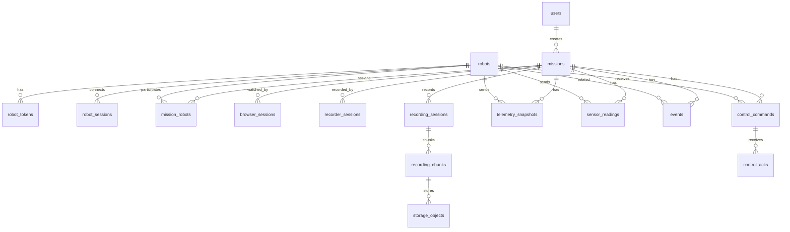

# Appendix. Data Storage

## 1. 문서 목적

AI Web P0의 PostgreSQL/PostGIS 테이블과 MinIO object key 규칙을 정의한다.

본 문서는 제품형 재작성 기준의 저장소 설계 문서이다.

## 2. 저장 원칙

- PostgreSQL에는 조회, 필터링, 감사, 관계 추적이 필요한 데이터를 저장한다.
- PostGIS에는 GPS 위치, 경로, 이벤트 위치를 저장한다.
- MinIO에는 MP4, OGG, JSONL, manifest, snapshot 같은 파일성 데이터를 저장한다.
- PostgreSQL에는 MinIO object key와 metadata만 저장한다.
- Robot팀 인터페이스가 확정되지 않은 데이터는 `raw_payload JSONB`로 보존한다.
- 모든 시간 컬럼은 UTC `timestamptz`를 사용한다.
- 주요 PK는 UUID를 사용한다.
- P0는 구현 가능한 최소 테이블부터 시작하고, AI/SLAM/보고서는 P1로 확장한다.

## 3. P0 테이블

### Identity / Access

- `users`

### Robot / Mission

- `robots`
- `robot_tokens`
- `missions`
- `mission_robots`

### Session

- `robot_sessions`
- `browser_sessions`
- `recorder_sessions`

### Realtime Data

- `telemetry_snapshots`
- `sensor_readings`

### Recording / Storage

- `recording_sessions`
- `recording_chunks`
- `storage_objects`

### Event / Control

- `events`
- `control_commands`
- `control_acks`

AI Agent 관련 테이블은 `docs/appendix/ai-agent.md`에서 별도 정의한다.

## 4. ERD 개요



## 5. Enum 후보

초기 구현은 text + check constraint를 권장한다.

### user_role

- `operator`
- `commander`
- `admin`

### mission_type

- `mountain_rescue`
- `collapse_site`
- `underground_facility`

### mission_status

- `ready`
- `active`
- `ended`
- `cancelled`

### robot_status

- `offline`
- `online`
- `assigned`
- `streaming`
- `reconnecting`
- `fault`

### session_state

- `new`
- `connected`
- `reconnecting`
- `disconnected`
- `failed`
- `closed`

### recording_status

- `pending`
- `recording`
- `finalizing`
- `uploaded`
- `failed`

### event_type

- `person_detected`
- `thermal_detected`
- `gas_risk`
- `temperature_risk`
- `communication_degraded`
- `battery_low`
- `robot_fault`
- `control_requested`
- `control_failed`
- `recording_failed`
- `system`

### severity

- `info`
- `notice`
- `warning`
- `critical`

### command_type

- `estop`
- `return_to_home`
- `ptz`
- `waypoint`

### command_status

- `requested`
- `sent`
- `accepted`
- `rejected`
- `executing`
- `succeeded`
- `failed`
- `timeout`

## 6. 테이블 상세

### 6.1 users

| Column | Type | Required | Note |
| --- | --- | --- | --- |
| id | uuid | yes | PK |
| login_id | text | yes | unique |
| password_hash | text | yes | PoC seed 가능 |
| display_name | text | yes |  |
| role | text | yes | operator, commander, admin |
| is_active | boolean | yes | default true |
| last_login_at | timestamptz | no |  |
| created_at | timestamptz | yes |  |
| updated_at | timestamptz | yes |  |

### 6.2 robots

| Column | Type | Required | Note |
| --- | --- | --- | --- |
| id | uuid | yes | PK |
| robot_code | text | yes | unique |
| display_name | text | yes |  |
| model_name | text | no | Android Mock, Jetson 등 |
| status | text | yes | robot_status |
| last_seen_at | timestamptz | no | heartbeat 기준 |
| last_streaming_at | timestamptz | no | streaming status 기준 |
| metadata | jsonb | yes | default `{}` |
| created_at | timestamptz | yes |  |
| updated_at | timestamptz | yes |  |

Indexes:

- `unique(robot_code)`
- `index(status)`
- `index(last_seen_at desc)`

### 6.3 robot_tokens

| Column | Type | Required | Note |
| --- | --- | --- | --- |
| id | uuid | yes | PK |
| robot_id | uuid | yes | FK robots.id |
| token_hash | text | yes | raw token 저장 금지 |
| name | text | yes | default 또는 Android Mock |
| is_active | boolean | yes | default true |
| last_used_at | timestamptz | no |  |
| created_at | timestamptz | yes |  |

P0에서는 token rotation/revoke UI는 제외하되, `is_active` 컬럼은 둔다.

### 6.4 missions

| Column | Type | Required | Note |
| --- | --- | --- | --- |
| id | uuid | yes | PK |
| mission_code | text | yes | unique, 예: mission-001 |
| name | text | yes | 임무명 |
| mission_type | text | yes | mission_type |
| status | text | yes | mission_status |
| created_by | uuid | yes | FK users.id |
| site_note | text | no | 현장 메모 |
| started_at | timestamptz | no |  |
| ended_at | timestamptz | no |  |
| created_at | timestamptz | yes |  |
| updated_at | timestamptz | yes |  |

### 6.5 mission_robots

| Column | Type | Required | Note |
| --- | --- | --- | --- |
| id | uuid | yes | PK |
| mission_id | uuid | yes | FK missions.id |
| robot_id | uuid | yes | FK robots.id |
| role | text | yes | primary, support |
| status | text | yes | assigned, active, completed, removed |
| joined_at | timestamptz | no |  |
| left_at | timestamptz | no |  |
| created_at | timestamptz | yes |  |
| updated_at | timestamptz | yes |  |

### 6.6 robot_sessions

Robot Gateway heartbeat와 streaming 상태를 추적한다.

| Column | Type | Required | Note |
| --- | --- | --- | --- |
| id | uuid | yes | PK |
| robot_id | uuid | yes | FK robots.id |
| mission_id | uuid | no | active mission |
| state | text | yes | robot_status |
| client_ip | inet | no |  |
| user_agent | text | no | Android Mock 등 |
| connected_at | timestamptz | yes |  |
| last_heartbeat_at | timestamptz | yes |  |
| disconnected_at | timestamptz | no |  |
| raw_payload | jsonb | yes | default `{}` |

### 6.7 browser_sessions

| Column | Type | Required | Note |
| --- | --- | --- | --- |
| id | uuid | yes | PK |
| mission_id | uuid | yes | FK missions.id |
| user_id | uuid | yes | FK users.id |
| state | text | yes | session_state |
| connected_at | timestamptz | yes |  |
| disconnected_at | timestamptz | no |  |
| metadata | jsonb | yes | default `{}` |

### 6.8 recorder_sessions

| Column | Type | Required | Note |
| --- | --- | --- | --- |
| id | uuid | yes | PK |
| mission_id | uuid | yes | FK missions.id |
| state | text | yes | session_state |
| started_at | timestamptz | yes |  |
| stopped_at | timestamptz | no |  |
| last_error | text | no |  |
| metadata | jsonb | yes | default `{}` |

### 6.9 telemetry_snapshots

Robot telemetry DataChannel 수신값을 저장한다.

| Column | Type | Required | Note |
| --- | --- | --- | --- |
| id | uuid | yes | PK |
| mission_id | uuid | yes | FK missions.id |
| robot_id | uuid | yes | FK robots.id |
| sequence | bigint | no | Robot sequence |
| sent_at | timestamptz | no | Robot timestamp |
| received_at | timestamptz | yes | server timestamp |
| battery_percent | numeric | no |  |
| network_quality | text | no |  |
| position_type | text | no | gps, slam, odometry |
| latitude | double precision | no | raw value |
| longitude | double precision | no | raw value |
| altitude_meter | double precision | no |  |
| accuracy_meter | double precision | no |  |
| heading_degree | double precision | no |  |
| geom | geometry(Point, 4326) | no | PostGIS |
| raw_payload | jsonb | yes | 원본 payload |

Indexes:

- `index(mission_id, received_at desc)`
- `index(robot_id, received_at desc)`
- `gist(geom)`

### 6.10 sensor_readings

환경 센서 수신값을 저장한다.

| Column | Type | Required | Note |
| --- | --- | --- | --- |
| id | uuid | yes | PK |
| mission_id | uuid | yes | FK missions.id |
| robot_id | uuid | yes | FK robots.id |
| sequence | bigint | no |  |
| sent_at | timestamptz | no |  |
| received_at | timestamptz | yes |  |
| temperature_celsius | numeric | no |  |
| humidity_percent | numeric | no |  |
| oxygen_percent | numeric | no |  |
| co_ppm | numeric | no |  |
| ch4_ppm | numeric | no |  |
| raw_payload | jsonb | yes | 원본 payload |

### 6.11 recording_sessions

| Column | Type | Required | Note |
| --- | --- | --- | --- |
| id | uuid | yes | PK |
| mission_id | uuid | yes | FK missions.id |
| robot_id | uuid | yes | FK robots.id |
| recorder_session_id | uuid | no | FK recorder_sessions.id |
| status | text | yes | recording_status |
| chunk_duration_seconds | integer | yes | default 600 |
| started_at | timestamptz | yes |  |
| ended_at | timestamptz | no |  |
| last_error | text | no |  |
| metadata | jsonb | yes | default `{}` |

### 6.12 recording_chunks

| Column | Type | Required | Note |
| --- | --- | --- | --- |
| id | uuid | yes | PK |
| recording_session_id | uuid | yes | FK recording_sessions.id |
| mission_id | uuid | yes | FK missions.id |
| robot_id | uuid | yes | FK robots.id |
| chunk_index | integer | yes | 1부터 시작 |
| status | text | yes | recording_status |
| started_at | timestamptz | yes |  |
| ended_at | timestamptz | no |  |
| duration_seconds | numeric | no |  |
| manifest_object_id | uuid | no | FK storage_objects.id |
| metadata | jsonb | yes | 실제 수신 codec/해상도/FPS 등 |

### 6.13 storage_objects

| Column | Type | Required | Note |
| --- | --- | --- | --- |
| id | uuid | yes | PK |
| mission_id | uuid | yes | FK missions.id |
| robot_id | uuid | no | FK robots.id |
| recording_chunk_id | uuid | no | FK recording_chunks.id |
| object_type | text | yes | rgb_av_chunk 등 |
| bucket | text | yes |  |
| object_key | text | yes | unique |
| content_type | text | no | video/mp4 등 |
| size_bytes | bigint | no |  |
| checksum | text | no |  |
| started_at | timestamptz | no | media start |
| ended_at | timestamptz | no | media end |
| metadata | jsonb | yes | codec, width, height, fps, bitrate |
| created_at | timestamptz | yes |  |

### 6.14 events

| Column | Type | Required | Note |
| --- | --- | --- | --- |
| id | uuid | yes | PK |
| mission_id | uuid | yes | FK missions.id |
| robot_id | uuid | no | FK robots.id |
| event_type | text | yes | event_type |
| severity | text | yes | severity |
| title | text | yes |  |
| description | text | no |  |
| occurred_at | timestamptz | yes |  |
| geom | geometry(Point, 4326) | no | 이벤트 위치 |
| related_storage_object_id | uuid | no | FK storage_objects.id |
| raw_payload | jsonb | yes | default `{}` |
| created_at | timestamptz | yes |  |

### 6.15 control_commands

| Column | Type | Required | Note |
| --- | --- | --- | --- |
| id | uuid | yes | PK |
| mission_id | uuid | yes | FK missions.id |
| robot_id | uuid | yes | FK robots.id |
| requested_by | uuid | yes | FK users.id |
| command_type | text | yes | command_type |
| status | text | yes | command_status |
| payload | jsonb | yes | command detail |
| requested_at | timestamptz | yes |  |
| sent_at | timestamptz | no |  |
| completed_at | timestamptz | no |  |
| failure_reason | text | no |  |

### 6.16 control_acks

| Column | Type | Required | Note |
| --- | --- | --- | --- |
| id | uuid | yes | PK |
| control_command_id | uuid | yes | FK control_commands.id |
| robot_id | uuid | yes | FK robots.id |
| ack_status | text | yes | accepted, rejected, executing, succeeded, failed |
| message | text | no |  |
| received_at | timestamptz | yes |  |
| raw_payload | jsonb | yes | default `{}` |

## 7. MinIO bucket

P0 bucket:

```text
robot-center
```

개발 환경에서는 `robot-center-poc`를 사용할 수 있으나, 제품형 compose에서는 `robot-center`를 기본값으로 둔다.

## 8. Object key 규칙

### 8.1 Recording media

```text
missions/{missionId}/robots/{robotCode}/recordings/{recordingSessionId}/chunks/{chunkIndex}/{trackName}_{chunkStart}_{chunkEnd}.{ext}
```

예시:

```text
missions/mission-001/robots/robot-001/recordings/rec-001/chunks/000001/rgb_20260518T080000Z_20260518T081000Z.mp4
missions/mission-001/robots/robot-001/recordings/rec-001/chunks/000001/thermal_20260518T080000Z_20260518T081000Z.mp4
```

### 8.2 Recording data

```text
missions/{missionId}/robots/{robotCode}/recordings/{recordingSessionId}/chunks/{chunkIndex}/sensor.jsonl
missions/{missionId}/robots/{robotCode}/recordings/{recordingSessionId}/chunks/{chunkIndex}/telemetry.jsonl
missions/{missionId}/robots/{robotCode}/recordings/{recordingSessionId}/chunks/{chunkIndex}/manifest.json
```

### 8.3 Event snapshot

```text
missions/{missionId}/robots/{robotCode}/events/{eventId}/snapshot.jpg
```

### 8.4 Report

```text
missions/{missionId}/reports/{reportId}.pdf
```

## 9. MP4 metadata

recorder-worker는 실제 수신/저장된 값을 metadata로 남긴다.

```json
{
  "trackName": "rgb",
  "container": "mp4",
  "videoCodec": "h264",
  "audioCodec": "opus",
  "width": 1280,
  "height": 720,
  "fps": 30,
  "bitrateKbps": 2500,
  "durationSeconds": 600
}
```

관제센터가 사전 해상도를 강제하지 않더라도, 저장과 조회를 위해 실제값은 반드시 남긴다.

## 10. Replay 설계

브라우저 replay는 MinIO object key를 직접 조합하지 않고 PostgreSQL metadata를 기준으로 조회한다.

```text
Browser
  -> app-server
  -> recording_sessions
  -> recording_chunks
  -> storage_objects
  -> MinIO presigned URL
```

P0 replay 대상:

- RGB MP4
- Thermal MP4
- sensor JSONL
- telemetry JSONL
- manifest JSON

### 10.1 manifest.json

각 chunk는 replay와 디버깅을 위해 manifest를 가진다.

예시:

```json
{
  "missionId": "mission-001",
  "robotCode": "robot-001",
  "recordingSessionId": "rec-001",
  "chunkIndex": 1,
  "startedAt": "2026-05-18T08:00:00Z",
  "endedAt": "2026-05-18T08:10:00Z",
  "tracks": {
    "rgb": {
      "objectKey": "missions/mission-001/robots/robot-001/recordings/rec-001/chunks/000001/rgb_20260518T080000Z_20260518T081000Z.mp4",
      "container": "mp4",
      "videoCodec": "h264",
      "audioCodec": "opus"
    },
    "thermal": {
      "objectKey": "missions/mission-001/robots/robot-001/recordings/rec-001/chunks/000001/thermal_20260518T080000Z_20260518T081000Z.mp4",
      "container": "mp4",
      "videoCodec": "h264"
    },
    "sensor": {
      "objectKey": "missions/mission-001/robots/robot-001/recordings/rec-001/chunks/000001/sensor.jsonl"
    },
    "telemetry": {
      "objectKey": "missions/mission-001/robots/robot-001/recordings/rec-001/chunks/000001/telemetry.jsonl"
    }
  }
}
```

### 10.2 replay API 원칙

app-server는 replay 화면에 object key 대신 조회용 metadata와 presigned URL을 내려준다.

관제 UI는 저장소의 파일 목록을 직접 탐색하지 않는다. UI 조회 단위는 `recording session`이고, 파일은 세션/청크의 하위 항목으로 표시한다.

```text
Browser
  -> GET /api/recordings
  -> recording session list
  -> chunk list
  -> file list with url
```

파일 응답 원칙:

- UI는 `url`이 있는 파일만 사용자 액션을 제공한다.
- `video/mp4` 파일은 녹화 화면 안에서 즉시 재생한다.
- manifest/JSONL 파일은 보조 `보기/열기` 액션으로 제공한다.
- UI는 `objectKey`를 화면 기본 정보로 표시하지 않는다.
- app-server는 개발 환경에서 MinIO API object URL을 반환할 수 있다.
- 운영 환경에서는 app-server가 권한 확인 후 presigned URL을 반환한다.

P0 파일 항목 예시:

```json
{
  "type": "rgb_audio_mp4",
  "label": "RGB MP4",
  "status": "available",
  "contentType": "video/mp4",
  "url": "http://control-center.example:9000/robot-center/missions/mission-001/..."
}
```

P0에서는 recorder-worker가 RGB H.264 + Opus를 MP4로 muxing하고, Thermal H.264를 별도 MP4로 muxing한다.
app-server는 실제 업로드 완료된 파일만 `available`로 응답한다.

```json
{
  "recordingSessionId": "rec-001",
  "chunkIndex": 1,
  "startedAt": "2026-05-18T08:00:00Z",
  "endedAt": "2026-05-18T08:10:00Z",
  "media": {
    "rgb": {
      "url": "https://minio-presigned-url",
      "contentType": "video/mp4"
    },
    "thermal": {
      "url": "https://minio-presigned-url",
      "contentType": "video/mp4"
    }
  },
  "data": {
    "sensor": {
      "url": "https://minio-presigned-url",
      "contentType": "application/x-ndjson"
    },
    "telemetry": {
      "url": "https://minio-presigned-url",
      "contentType": "application/x-ndjson"
    }
  }
}
```

### 10.3 브라우저 호환성

P0 master 저장 포맷:

```text
rgb.mp4      H.264 + Opus
thermal.mp4  H.264
```

브라우저 replay에서 호환성 문제가 생기면 P1에서 replay derivative를 추가한다.

후보:

```text
rgb_replay.mp4  H.264 + AAC
HLS/fMP4 playlist
```

## 11. Migration 우선순위

1. `users`, `robots`, `robot_tokens`
2. `missions`, `mission_robots`
3. `robot_sessions`, `browser_sessions`, `recorder_sessions`
4. `telemetry_snapshots`, `sensor_readings`
5. `recording_sessions`, `recording_chunks`, `storage_objects`
6. `events`
7. `control_commands`, `control_acks`
