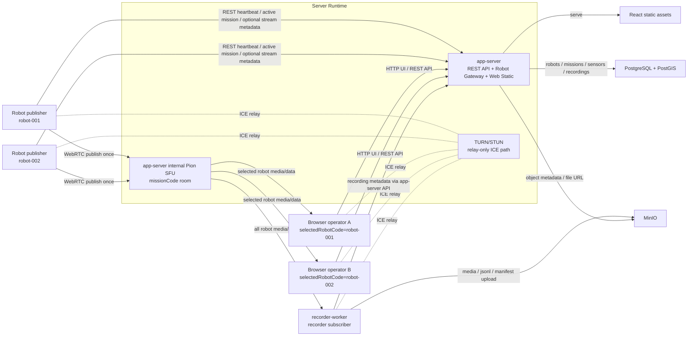
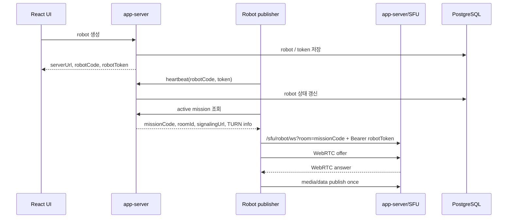
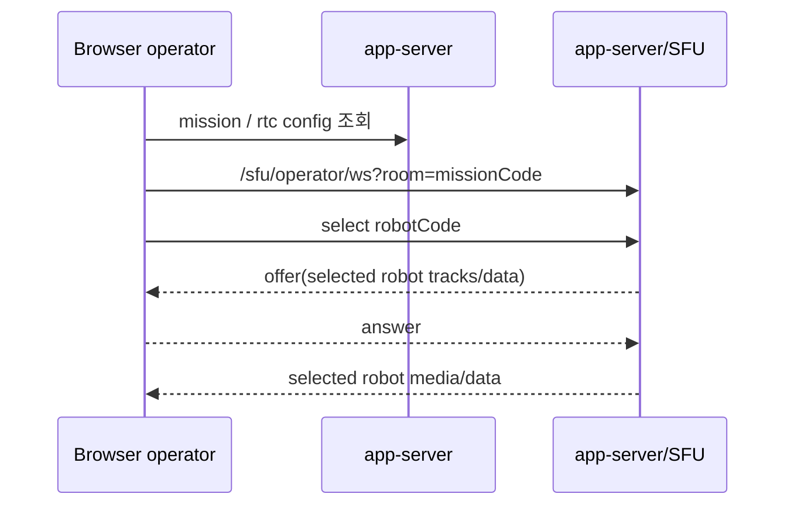
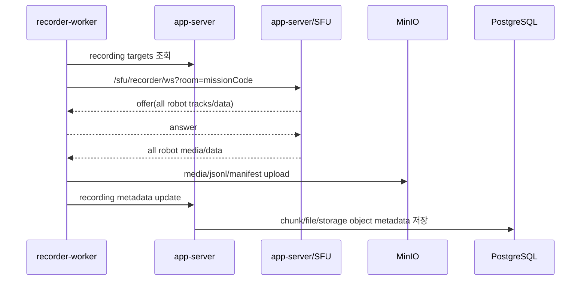
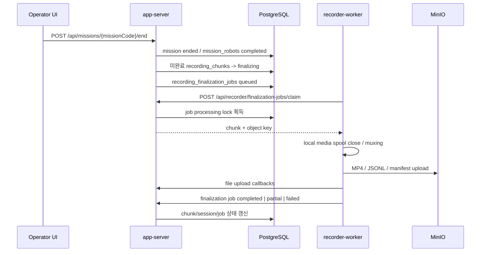

# Architecture

## 1. 문서 목적

AI Web P0의 현재 서버/로봇/WebRTC/SFU/저장 아키텍처를 설명한다.

본 문서는 현재 구현과 검증된 서버/SFU 구조를 기준으로 한다.

이 문서는 다음을 정의한다.

- `app-server` 내부 SFU 기반 WebRTC 흐름
- 미션 단위 다중 로봇 room 구조
- 다중 브라우저 관제자와 recorder-worker subscriber 구조
- PostgreSQL/GORM, MinIO, recorder-worker 저장 구조
- SensorDescriptor / SensorSample 저장 모델의 책임

이 문서는 다음을 확정하지 않는다.

- REST endpoint별 상세 JSON schema
- WebRTC signaling message 상세 JSON schema
- SDP 내부 내용
- ICE candidate JSON wrapper
- DataChannel payload 상세 schema
- codec, bitrate, resolution 정책
- MinIO object key 상세 규칙

## 2. 현재 아키텍처 방향

P0는 서버를 과도하게 분리하지 않고, 다음 구성으로 시작한다.

- `app-server`: Go REST API, robot gateway, mission 관리, Web static serving, 내부 Pion SFU
- `recorder-worker`: SFU subscriber로 붙어 media/data를 저장하는 별도 Go 프로세스
- `turn-server`: relay-only WebRTC 연결을 위한 TURN/STUN 프로세스
- `PostgreSQL/PostGIS`: 구조화 데이터, 위치/센서/녹화 metadata 저장
- `MinIO`: media, JSONL, manifest 같은 object artifact 저장
- `React UI`: 관제, live, replay, mission/robot 운영 화면
- `Python Mock Robot`: Android 단말이 없을 때 로봇팀 연동 절차를 설명하고 검증하기 위한 mock publisher

현재 로컬 개발 스크립트 기준으로는 PostgreSQL/MinIO는 Docker Compose로 띄우고, `app-server`, `recorder-worker`, `turn-server`, Python mock robot은 host `screen` 세션으로 실행한다.

운영 패키징에서는 `app-server`, `recorder-worker`, `turn-server`를 container service로 옮길 수 있지만, 아키텍처 책임은 동일하다.

## 3. 전체 구성



## 4. 핵심 구조

### 4.1 Mission Room

현재 WebRTC room은 미션 단위다.

```text
1 missionCode = 1 SFU room
1 mission room = N robot publishers + N browser subscribers + 1 recorder subscriber
```

예시:

```text
mission-005 room
  publishers:
    robot-001
    robot-002

  subscribers:
    browser A selected robot-001
    browser B selected robot-002
    recorder-worker all robots
```

핵심 불변 조건:

- Robot은 subscriber 수와 무관하게 mission room에 한 번만 publish 한다.
- Browser operator는 같은 mission room에 붙고, UI에서 선택한 `selectedRobotCode`만 수신한다.
- 여러 Browser operator가 동시에 붙을 수 있고, 각자 다른 robot을 선택할 수 있다.
- Recorder는 같은 mission room에 recorder subscriber로 붙고 모든 robotCode를 수신한다.
- Robot identity는 room id가 아니라 `robotCode`로 유지한다.
- operator의 선택 상태는 `robotCode`가 아니라 `selectedRobotCode`로 관리한다.

### 4.2 WebRTC Signaling

현재 signaling endpoint는 app-server 내부 SFU가 제공한다.

```text
GET /sfu/robot/ws?room={missionCode}
Authorization: Bearer {robotToken}

GET /sfu/operator/ws?room={missionCode}
GET /sfu/recorder/ws?room={missionCode}
```

역할:

| role | 의미 |
| --- | --- |
| `robot` | mission room에 media/data를 publish하는 publisher |
| `operator` | Browser live 관제용 subscriber |
| `recorder` | 저장용 subscriber |

현재 연결 방향:

```text
Robot
-> WebSocket signaling
-> offer
-> app-server/SFU answer
-> media/data publish

Browser operator
-> WebSocket signaling
-> SFU offer
-> browser answer
-> selected robot media/data subscribe

recorder-worker
-> WebSocket signaling
-> SFU offer
-> recorder answer
-> all robot media/data subscribe
```

SDP는 WebRTC가 생성하는 session description이다. 앱이 SDP 내부 codec line을 직접 계약으로 정의하지 않고, 현재는 Pion/브라우저/aiortc 협상 결과를 사용한다.

ICE는 relay-only 정책으로 TURN 경로를 기준으로 한다.

## 5. Track / DataChannel 슬롯

현재 신규 구조의 canonical 슬롯은 다음을 기준으로 한다.

### 5.1 Media Track

```text
track.video_1
track.video_2
track.audio_1
track.audio_2
```

운영 의미는 metadata/UI 표시에서 부여한다.

현재 Python mock과 UI는 다음 의미로 표시한다.

| Slot | 현재 mock/UI 표시 |
| --- | --- |
| `track.video_1` | RGB |
| `track.video_2` | Thermal |
| `track.audio_1` | Audio |
| `track.audio_2` | reserved secondary audio slot |

`rgb`, `thermal`, `audio`, `sensor`, `telemetry` 같은 legacy label은 호환 fallback으로만 취급한다. 신규 구현은 canonical slot label을 우선 사용한다.

### 5.2 DataChannel

```text
channel.telemetry
channel.spatial
channel.event
channel.control
```

역할:

| Channel | 현재 책임 |
| --- | --- |
| `channel.telemetry` | 위치, 환경, 배터리 같은 저속 상태 샘플 |
| `channel.spatial` | IMU, odometry, point cloud descriptor 같은 공간/자세 계열 |
| `channel.event` | 로봇 이벤트 |
| `channel.control` | control 방향을 위한 reserved channel |

현재 Python mock은 `channel.control`을 생성하지만 control payload를 자동 송신하지 않는다. Browser -> SFU -> Robot 방향 control forwarding과 승인/감사 정책은 TODO로 남긴다.

## 6. SensorDescriptor / SensorSample 저장 모델

센서 저장은 descriptor와 sample을 분리한다.

### 6.1 SensorDescriptor

`SensorDescriptor`는 “이 로봇이 어떤 센서를 보낼 수 있는가”를 설명하는 metadata다.

식별 기준:

```text
missionId + robotCode + sensorId
```

주요 필드 의미:

| Field | 의미 |
| --- | --- |
| `missionId` | 센서가 관측된 mission |
| `robotCode` | 센서를 publish한 robot |
| `sensorId` | robot 내부에서 안정적으로 쓰는 sensor slot id |
| `channelRole` | 들어온 DataChannel 역할 |
| `displayName` | UI 표시명 |
| `sensorType` | position, imu, gas, point_cloud 등 센서 계열. 로봇 payload descriptor 필수값 |
| `unit` | 표시 단위 |
| `enabled` | UI/저장 대상으로 활성화할지 여부 |
| `metadata` | frameId, axes 같은 부가 정보 |
| `firstSeenAt` / `lastSeenAt` | 최초/마지막 관측 시각 |

### 6.2 SensorSample

`SensorSample`은 특정 시점에 들어온 실제 측정값이다.

주요 필드 의미:

| Field | 의미 |
| --- | --- |
| `descriptorId` | 연결된 SensorDescriptor id |
| `missionId` | sample이 속한 mission |
| `robotCode` | sample을 보낸 robot |
| `sensorId` | descriptor와 매칭되는 sensor id |
| `channelRole` | telemetry/spatial/event 등 수신 채널 역할 |
| `messageId` | 메시지 추적 id |
| `sample_timestamp` / `receivedAt` | sample 측정 시각과 서버 수신 시각 |
| `values` / `objectKey` | object 기반 측정값 또는 object storage 참조 |
| `rawPayload` | 원본 또는 정규화 전 payload snapshot |

샘플만 들어오고 descriptor가 없으면 서버는 기존 descriptor를 기준으로 저장한다. 새 sensorId를 처음 보낼 때는 descriptor를 함께 보내야 하며, descriptor의 `sensorType`은 필수다.

최신 센서 조회는 반드시 다음 기준으로 분리한다.

```text
robotCode + sensorId
```

따라서 `robot-001`과 `robot-002`가 모두 `telemetry.battery_1`을 보내도 UI/API에서는 서로 다른 최신값으로 유지한다.

## 7. 구성요소 책임

### 7.1 Robot Publisher

Robot publisher는 Android 실제 단말, Android sample, Python mock 중 하나일 수 있다.

공통 책임:

- 관제에서 발급한 `serverUrl`, `robotCode`, `robotToken` 사용
- heartbeat 송신
- active mission 조회
- missionCode room에 WebRTC publish
- media track 송신
- telemetry/spatial/event DataChannel 송신

Robot은 관제 시스템에서 robot을 직접 생성하지 않는다. 로봇 생성과 token 발급은 app-server/UI에서 수행하고, Robot은 발급 정보를 입력받아 연결한다.

### 7.2 app-server

`app-server`는 P0의 중심 서버 프로세스다.

책임:

- Web UI static serving
- REST API
- robot 등록/조회/수정
- robot token 발급과 검증
- heartbeat 수신
- mission 생성/시작/종료
- mission robot assignment 관리
- robot gateway active mission 조회
- mission live-status 합성 API 제공
- recording metadata 조회
- sensor descriptor/sample 저장과 최신값 조회
- MinIO object metadata 조회와 파일 URL 제공
- SFU signaling endpoint 제공
- SFU room/session 상태 관리
- SFU observed stream, recorder runtime, mission assignment, robot heartbeat를 합성한 live-status 제공
- Robot publisher 검증
- Browser operator subscriber 관리
- recorder-worker subscriber 관리
- RTP fan-out
- DataChannel relay

비책임:

- TURN relay 역할
- MP4 muxing
- 장기 object 파일 생성
- MinIO/PostgreSQL 자체 저장 엔진 역할

### 7.3 app-server 내부 SFU

SFU module은 `app-server` 내부의 Pion 기반 media/data router다.

책임:

- missionCode room 관리
- Robot publisher PeerConnection 관리
- Browser operator subscriber PeerConnection 관리
- recorder subscriber PeerConnection 관리
- robotCode별 published track 관리
- selectedRobotCode 기준 operator fan-out
- recorder 대상으로 all robot fan-out
- RTCP/PLI/keyframe 요청 전달
- DataChannel message relay
- publisher별 `lastTrackAt`, `lastDataAt`, track/DataChannel 목록 관측
- peer 종료 시 publisher/subscriber/session 정리

현재 구조는 P0 검증용 app-server 내부 SFU다. 운영 규모가 커지면 SFU 서버 분리나 LiveKit/Janus/mediasoup 같은 외부 SFU 도입을 재검토한다.

### 7.4 recorder-worker

`recorder-worker`는 저장 전용 프로세스다.

책임:

- app-server에서 active recording target 조회
- mission room에 recorder role로 WebRTC subscribe
- 같은 mission room의 모든 robotCode 수신
- media/data 흐름 수신
- chunk lifecycle 처리
- media 파일 생성
- sensor/telemetry JSONL 생성
- manifest 생성
- MinIO upload
- app-server API를 통한 recording metadata 갱신
- 종료된 mission의 미완료 chunk finalization job claim
- finalization job 기준 MP4 muxing / JSONL upload / manifest upload 완료 처리

분리 이유:

- muxing과 object upload는 CPU/IO 부하가 크다.
- 저장 실패가 API와 실시간 관제에 영향을 주면 안 된다.
- Browser를 닫아도 녹화는 계속되어야 한다.
- 이후 저장 worker만 별도로 확장할 수 있다.

종료 처리 원칙:

- mission 종료 시 app-server는 미완료 `recording_chunks`를 즉시 `stopped`로 닫지 않는다.
- app-server는 `recording_finalization_jobs`를 생성하고 chunk 상태를 `finalizing`으로 둔다.
- recorder-worker는 job을 claim한 뒤 local media spool을 기준으로 MP4 muxing, JSONL upload, manifest upload를 수행한다.
- 업로드 가능한 media가 하나도 없으면 chunk는 `partial`로 마무리한다.
- mux/upload 오류가 발생하면 chunk/job은 `failed`로 남긴다.
- 이미 upload 완료 callback이 들어온 chunk의 job은 completed로 정리되어 중복 finalization이 replay 상태를 되돌리지 않는다.

### 7.5 React Operator UI

React UI는 관제 운영 화면이다.

책임:

- 로봇 등록과 연결 정보 표시
- 임무 생성/시작/종료
- active mission live 관제
- 로봇 선택 드롭다운
- 선택한 로봇 RGB/Thermal/Audio 표시
- 선택한 로봇 위치/센서 최신값 표시
- recording chunk/replay 조회
- 시스템 상태 표시

UI는 Robot에 직접 명령하지 않는다. 제어 요청은 app-server API와 control 정책을 거쳐야 한다.

### 7.6 PostgreSQL / GORM

PostgreSQL은 구조화 데이터의 기준 저장소다.

현재 Go 서버는 GORM을 사용한다. 개발 단계에서는 schema 변경 속도를 우선해 `AutoMigrate` 사용을 허용한다.

저장 대상:

- robots / robot tokens
- missions / mission robot assignments
- optional streaming metadata
- sensor_descriptors
- sensor_samples
- recording_sessions
- recording_chunks
- storage_objects
- events
- control command metadata

GORM model은 persistence concern이며 API response DTO와 분리한다.

### 7.7 MinIO

MinIO는 파일성 artifact의 object storage다.

저장 대상:

- RGB/Audio media file
- Thermal media file
- sensor JSONL
- telemetry JSONL
- manifest
- event/report artifact

MinIO object key는 UI가 직접 조합하지 않는다. UI는 app-server API가 제공하는 metadata와 URL만 사용한다.

### 7.8 Live Status SSOT

관제 Live 화면에서 `송출`, `녹화`, `연결` 상태를 표시할 때의 기준 API는 다음이다.

```http
GET /api/missions/{missionCode}/live-status
```

이 API는 app-server가 다음 runtime/source를 합성해 만든다.

| 상태 | 기준 source | 비고 |
| --- | --- | --- |
| Connection | robot heartbeat / `robots.device_state` | 장치 상태와 heartbeat freshness를 합성한 연결 상태 |
| Stream | app-server 내부 SFU observed publisher | `lastTrackAt` 또는 `lastDataAt` freshness 기준 |
| Recording | recorder-worker `/healthz` robot runtime | robot별 track/data 수신 freshness 기준 |
| Latest chunk | `recording_chunks` | replay/history 참고 정보 |

중요한 분리 원칙:

- Live 화면의 `송출 중/송출 대기`는 SFU observed stream으로 판단한다.
- Live 화면의 `녹화 중/녹화 대기`는 `recording_chunks.status`만으로 판단하지 않는다.
- `recording_chunks`는 replay/history와 upload 결과를 위한 저장 metadata다.
- recorder-worker `/healthz` 조회에 실패하거나 robot별 runtime이 없으면 `recording`으로 표시하지 않는다.
- 종료된 mission은 live 상태가 아니라 replay/history 화면에서 다룬다.

## 8. 주요 시퀀스

### 8.1 Robot 연결



### 8.2 Browser Live 관제



Browser A와 Browser B는 같은 mission room에 붙어도 각자 독립적인 subscriber다.

### 8.3 Recording



## 9. 저장 파이프라인

```text
app-server/SFU
-> recorder-worker
   -> local chunk buffer
   -> media muxing
   -> JSONL/manifest 생성
   -> MinIO upload
   -> app-server API
   -> PostgreSQL metadata write
   -> UI replay 조회
```

기본 chunk duration은 10분이다. 단, chunk/session 생성 기준은 mission start가 아니라 recorder-worker가 robot media packet을 실제로 수신한 시점이다. Mission active 상태는 녹화 허용 조건이며, media가 들어오기 전에는 recording chunk를 만들지 않는다.

H264 snapshot은 RTP timestamp cadence로 관측한 입력 fps를 사용해 MP4로 mux한다. 관측값이 없거나 비정상인 경우에만 fallback fps를 사용한다. 따라서 robot이 15fps로 송출한 raw H264를 recorder가 30fps로 해석해 재생 시간이 줄어드는 문제를 피한다.

대표 산출물:

```text
rgb.mp4
thermal.mp4
audio.ogg 또는 audio artifact
sensor.jsonl
telemetry.jsonl
manifest.json
```

Browser는 MinIO object key를 직접 조합하지 않는다.

```text
Browser
-> app-server: mission recording chunk 목록 조회
-> PostgreSQL: recording_chunks + storage_objects 조회
-> app-server: file URL 제공
-> Browser: replay
```

### 9.1 Mission 종료와 finalization job

Mission 종료 시 녹화는 다음 순서로 끝난다.



이 방식의 목적은 “mission 종료 버튼을 누르면 DB 상태만 바꾸는 것”이 아니라, recorder-worker가 실제 muxing과 upload를 완료할 기회를 보장하는 것이다.

### 9.2 recorder-worker scale-out 고려사항

P0 로컬 검증은 recorder-worker 1개를 기준으로 한다. recorder-worker를 여러 개로 늘릴 때는 다음 조건이 필요하다.

| 항목 | 고려사항 |
| --- | --- |
| Job claim | `recording_finalization_jobs`는 DB row lock과 `SKIP LOCKED`로 한 worker만 claim해야 한다. |
| Lock TTL | worker crash를 대비해 `locked_until`이 지나면 다른 worker가 재claim할 수 있어야 한다. |
| Fencing | upload/file/chunk/job status callback은 claim 시점의 `workerId + attempt`가 현재 DB lock owner와 일치할 때만 반영해야 한다. |
| Idempotency | MinIO object key와 app-server upload callback은 재시도되어도 같은 결과가 되도록 object key/upsert 기준이어야 한다. |
| Room ownership | 같은 mission room을 여러 recorder가 동시에 subscribe하면 중복 녹화가 생길 수 있으므로 room/mission 단위 lease 또는 shard가 필요하다. |
| Local spool | 현재 media spool은 recorder-worker local filesystem에 있다. Scale-out failover까지 하려면 shared spool, object staging, 또는 room ownership sticky 정책이 필요하다. |
| Partial result | job을 claim한 worker가 raw media를 찾지 못하면 `partial`로 끝날 수 있다. 운영 scale-out에서는 해당 chunk를 실제로 녹화한 worker가 finalization하도록 소유권을 유지해야 한다. |
| Backpressure | muxing/upload가 밀릴 때 claim limit, retry interval, lock duration, worker concurrency를 분리해서 조절해야 한다. |
| Monitoring | job 상태별 count(`queued`, `processing`, `partial`, `failed`)와 locked job age를 지표로 노출해야 한다. |

따라서 단순히 worker replica 수만 늘리는 것은 충분하지 않다. 먼저 “mission room recording owner”와 “finalization job owner”를 명확히 둔 뒤 scale-out해야 한다.

## 10. 위치 데이터

P0 위치 데이터는 `channel.telemetry`의 position sample로 들어온다.

UI는 다음을 표시한다.

- 현재 위치 marker
- GPS accuracy 또는 품질 정보
- heading 또는 orientation
- 이동 경로 polyline
- 마지막 수신 시각

GPS가 제한되는 환경은 `channel.spatial`의 odometry/SLAM 계열 sample로 확장한다.

## 11. 장애 격리

| 장애 | 기대 동작 |
| --- | --- |
| Robot publish 실패 | 해당 robotCode stream만 중단 |
| Browser 연결 실패 | 해당 Browser subscriber만 재시도 |
| Browser 선택 변경 실패 | 해당 Browser의 선택/재협상만 실패 |
| recorder-worker 실패 | 저장만 중단되고 Browser live 관제는 유지 |
| MinIO upload 실패 | recording chunk/file 실패 상태 기록 |
| PostgreSQL 실패 | API read/write 실패를 명시적 에러로 반환 |
| TURN 실패 | relay-only 정책에서는 WebRTC 연결 실패로 처리 |
| app-server 재시작 | REST API와 내부 SFU 연결이 함께 재시작됨 |

원칙:

- Browser 하나가 끊겨도 Robot publish는 유지한다.
- Browser 하나가 끊겨도 다른 Browser와 recorder-worker는 유지한다.
- recorder-worker가 죽어도 Browser live 관제는 유지한다.
- Robot 하나가 끊겨도 같은 mission의 다른 Robot stream은 유지한다.

## 12. 현재 코드 기준 모듈

```text
apps/server/cmd/app-server
apps/server/cmd/recorder-worker
apps/server/cmd/turn-server
apps/server/internal/api
apps/server/internal/service
apps/server/internal/store
apps/server/internal/sfu
apps/server/internal/recording
apps/mock-robot-python
apps/web
deploy/docker-compose.yml
```

현재 로컬 검증 플로우:

```text
PostgreSQL / MinIO
-> app-server
-> recorder-worker
-> Python Mock Robot 2대
-> app-server internal SFU mission room
-> Browser UI
-> sensor/recording 저장
```

검증 기준은 현재 코드 실행 결과와 `docs/stable/multi-robot-sfu-checklist.md`를 함께 따른다.
