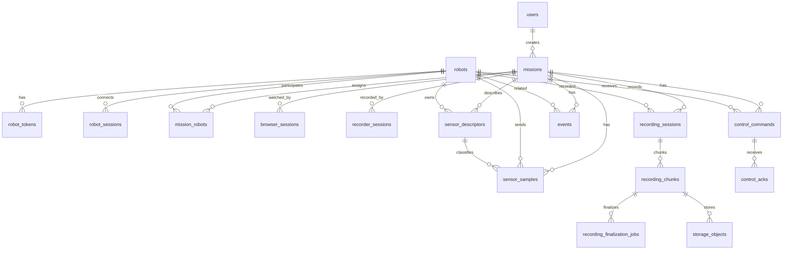

# Data Storage

## 1. 문서 목적

AI Web P0의 PostgreSQL/PostGIS 테이블, GORM schema 관리 방식, MinIO object 저장 규칙, sensor/recording 저장 흐름을 정의한다.

본 문서는 현재 구현 기준의 저장소 설계 문서다. 상세 REST JSON, WebRTC signaling JSON, DataChannel payload schema는 별도 문서에서 다룬다.

## 2. 저장 원칙

- PostgreSQL에는 조회, 필터링, 감사, 관계 추적이 필요한 데이터를 저장한다.
- PostgreSQL schema는 현재 개발 단계에서 GORM `AutoMigrate`를 기준으로 생성한다.
- PostGIS extension은 활성화하지만, 현재 구현에서 직접 geometry column을 쓰는 테이블은 `events.geom`이다.
- MinIO에는 MP4, OGG, JSONL, manifest 같은 파일성 데이터를 저장한다.
- PostgreSQL에는 MinIO object 본문을 저장하지 않고, object key, content type, size, metadata만 저장한다.
- Robot/SFU 인터페이스가 아직 확정되지 않은 payload는 `raw_payload` 또는 `metadata` JSONB로 보존한다.
- 시간 컬럼은 UTC 기준 `timestamptz`로 저장한다.
- 주요 PK는 PostgreSQL `gen_random_uuid()` 기반 UUID다.
- 개발 단계에서는 빠른 schema 변경을 위해 PostgreSQL/MinIO 데이터를 초기화할 수 있다.

## 3. Schema 관리

`app-server` 시작 시 PostgreSQL store는 다음을 수행한다.

```text
CREATE EXTENSION IF NOT EXISTS pgcrypto
CREATE EXTENSION IF NOT EXISTS postgis
GORM AutoMigrate(...)
post AutoMigrate DDL
bootstrap user seed
```

AutoMigrate 대상:

```text
users
robots
robot_tokens
missions
mission_robots
robot_sessions
browser_sessions
recorder_sessions
sensor_descriptors
sensor_samples
recording_sessions
recording_chunks
recording_finalization_jobs
storage_objects
events
control_commands
control_acks
```

추가 DDL:

- `mission_robots_active_unique`: `mission_id + robot_id` active assignment 중복 방지
- `events_geom_idx`: `events.geom` GIST index
- recording finalization job FK/index: chunk/session/mission/robot 관계와 claim 조회를 위한 index
- `recording_chunks_manifest_object_fk`: `recording_chunks.manifest_object_id -> storage_objects.id`

초기 seed:

- `users.login_id = operator`
- `users.password_hash = seed-password-placeholder`

## 4. 현재 테이블 그룹

| Group | Tables | 현재 역할 |
| --- | --- | --- |
| Identity / Access | `users` | PoC operator seed |
| Robot / Mission | `robots`, `robot_tokens`, `missions`, `mission_robots` | 로봇 등록, token, 다중 로봇 mission assignment |
| Runtime Session | `robot_sessions`, `browser_sessions`, `recorder_sessions` | heartbeat/session 이력. live 송출 판정은 SFU observed stream 상태를 기준으로 함 |
| Realtime Sensor | `sensor_descriptors`, `sensor_samples` | telemetry/spatial DataChannel 저장과 최신값 조회 |
| Recording / Storage | `recording_sessions`, `recording_chunks`, `recording_finalization_jobs`, `storage_objects` | recorder-worker chunk, finalization job, upload 상태, MinIO object metadata |
| Event / Control | `events`, `control_commands`, `control_acks` | P0/P1 event/control 감사 기록 기반. control 정책은 아직 TODO |

## 5. ERD 개요



## 6. 상태 값 기준

현재 구현은 PostgreSQL enum type 대신 `text` 컬럼과 애플리케이션 검증을 사용한다.

대표 상태:

| Domain | Values |
| --- | --- |
| mission status | `ready`, `active`, `ended`, `cancelled` |
| robot device state | `offline`, `online`, `fault` |
| mission robot status | `assigned`, `active`, `completed`, `removed` |
| session state | `new`, `connected`, `reconnecting`, `disconnected`, `failed`, `closed` |
| recording status | `pending`, `recording`, `finalizing`, `uploaded`, `partial`, `failed` |
| command status | `requested`, `sent`, `accepted`, `rejected`, `executing`, `succeeded`, `failed`, `timeout` |

`robots.device_state`는 장치 상태만 표현한다. API의 `robot.status`는 `device_state + last_seen_at`을 합성한 현재 연결 상태다. 임무 배정 여부는 `mission_robots`, WebRTC live 송출 여부와 freshness는 app-server 내부 SFU observed stream 상태를 기준으로 판단한다.

## 7. 테이블 상세

### 7.1 users

| Column | Type | Required | Note |
| --- | --- | --- | --- |
| `id` | uuid | yes | PK |
| `login_id` | text | yes | unique |
| `password_hash` | text | yes | PoC seed placeholder |
| `display_name` | text | yes |  |
| `role` | text | yes | operator, commander, admin |
| `is_active` | boolean | yes | default true |
| `last_login_at` | timestamptz | no |  |
| `created_at` | timestamptz | yes | default now |
| `updated_at` | timestamptz | yes | default now |

### 7.2 robots

| Column | Type | Required | Note |
| --- | --- | --- | --- |
| `id` | uuid | yes | PK |
| `robot_code` | text | yes | unique, 예: `robot-001` |
| `display_name` | text | yes | UI 표시명 |
| `model_name` | text | no | Python Mock, Android, Jetson 등 |
| `device_state` | text | yes | default `offline`; 장치 상태 `offline`, `online`, `fault` |
| `last_seen_at` | timestamptz | no | heartbeat 기준 |
| `archived_at` | timestamptz | no | archive 처리 시각 |
| `metadata` | jsonb | yes | default `{}` |
| `created_at` | timestamptz | yes | default now |
| `updated_at` | timestamptz | yes | default now |

### 7.3 robot_tokens

| Column | Type | Required | Note |
| --- | --- | --- | --- |
| `id` | uuid | yes | PK |
| `robot_id` | uuid | yes | FK robots.id |
| `token_hash` | text | yes | 검증 기준 |
| `token_plaintext` | text | no | 현재 개발 편의를 위한 connection-info 재조회용. 운영 전 제거/암호화 검토 필요 |
| `name` | text | yes | default token name |
| `is_active` | boolean | yes | default true |
| `last_used_at` | timestamptz | no |  |
| `created_at` | timestamptz | yes | default now |

### 7.4 missions

| Column | Type | Required | Note |
| --- | --- | --- | --- |
| `id` | uuid | yes | PK |
| `mission_code` | text | yes | unique, SFU room id 기준 |
| `name` | text | yes | 임무명 |
| `mission_type` | text | yes | 예: `mountain_rescue` |
| `status` | text | yes | default `ready` |
| `created_by` | uuid | no | FK users.id 예정 |
| `site_note` | text | no | 현장 메모 |
| `started_at` | timestamptz | no |  |
| `ended_at` | timestamptz | no |  |
| `created_at` | timestamptz | yes | default now |
| `updated_at` | timestamptz | yes | default now |

### 7.5 mission_robots

미션당 다중 로봇 assignment 기준 테이블이다.

| Column | Type | Required | Note |
| --- | --- | --- | --- |
| `id` | uuid | yes | PK |
| `mission_id` | uuid | yes | FK missions.id |
| `robot_id` | uuid | yes | FK robots.id |
| `role` | text | yes | default `primary` |
| `status` | text | yes | default `assigned`; `removed`는 inactive assignment |
| `joined_at` | timestamptz | no |  |
| `left_at` | timestamptz | no |  |
| `created_at` | timestamptz | yes | default now |
| `updated_at` | timestamptz | yes | default now |

Index:

- partial unique: `mission_id, robot_id WHERE status != 'removed'`

### 7.6 runtime session tables

#### robot_sessions

Robot heartbeat/session 이력용 테이블이다. 현재 핵심 online 상태는 `robots.device_state`, `robots.last_seen_at`을 합성한 domain method가 판단하고, live 화면의 송출 상태는 SFU observed stream이 담당한다.

| Column | Type | Required | Note |
| --- | --- | --- | --- |
| `id` | uuid | yes | PK |
| `robot_id` | uuid | yes | FK robots.id |
| `mission_id` | uuid | no | active mission |
| `state` | text | yes | robot/session state |
| `client_ip` | inet | no |  |
| `user_agent` | text | no |  |
| `connected_at` | timestamptz | yes | default now |
| `last_heartbeat_at` | timestamptz | yes | default now |
| `disconnected_at` | timestamptz | no |  |
| `raw_payload` | jsonb | yes | default `{}` |

#### browser_sessions

Browser operator session 이력용 테이블이다. 현재 SFU live session의 실시간 상태는 in-memory SFU room summary가 기준이다.

| Column | Type | Required | Note |
| --- | --- | --- | --- |
| `id` | uuid | yes | PK |
| `mission_id` | uuid | yes | FK missions.id |
| `user_id` | uuid | no | FK users.id 예정 |
| `state` | text | yes | session state |
| `connected_at` | timestamptz | yes | default now |
| `disconnected_at` | timestamptz | no |  |
| `metadata` | jsonb | yes | default `{}` |

#### recorder_sessions

Recorder worker session 이력용 테이블이다. 현재 recorder runtime status는 worker health endpoint와 room status도 함께 사용한다.

| Column | Type | Required | Note |
| --- | --- | --- | --- |
| `id` | uuid | yes | PK |
| `mission_id` | uuid | yes | FK missions.id |
| `state` | text | yes | session state |
| `started_at` | timestamptz | yes | first recorder media tick 기준 |
| `stopped_at` | timestamptz | no |  |
| `last_error` | text | no |  |
| `metadata` | jsonb | yes | default `{}` |

## 8. Sensor 저장 모델

### 8.1 sensor_descriptors

`SensorDescriptor`는 “이 mission의 이 robot이 어떤 sensor slot을 보낼 수 있는가”를 설명한다.

식별 기준:

```text
mission_id + robot_id + sensor_id
```

| Column | Type | Required | Note |
| --- | --- | --- | --- |
| `id` | uuid | yes | PK |
| `mission_id` | uuid | yes | FK missions.id |
| `robot_id` | uuid | yes | FK robots.id |
| `sensor_id` | text | yes | 예: `telemetry.battery_1`, `spatial.imu_1` |
| `channel_role` | text | yes | `channel.telemetry`, `channel.spatial` 등 |
| `display_name` | text | yes | UI 표시명. 자동 생성 시 `sensor_id` |
| `sensor_type` | text | yes | position, imu, gas, point_cloud, unknown 등 |
| `unit` | text | no | percent, ppm 등 |
| `enabled` | boolean | yes | UI/저장 활성 여부 |
| `metadata` | jsonb | yes | default `{}` |
| `first_seen_at` | timestamptz | yes | default now |
| `last_seen_at` | timestamptz | yes | default now, index |

Index:

- unique: `mission_id, robot_id, sensor_id`
- index: `mission_id`
- index: `robot_id`
- index: `sensor_type`
- index: `last_seen_at`

Descriptor upsert 정책:

- robot payload에 descriptors가 있으면 `mission_id + robot_id + sensor_id` 기준으로 upsert한다.
- descriptor 없는 sample만 들어와도 서버가 최소 descriptor를 자동 생성한다.
- 자동 descriptor metadata는 현재 `{"source":"auto-sample"}`를 사용한다.

### 8.2 sensor_samples

`SensorSample`은 특정 시점에 들어온 실제 측정값이다.

| Column | Type | Required | Note |
| --- | --- | --- | --- |
| `id` | uuid | yes | PK |
| `descriptor_id` | uuid | no | FK sensor_descriptors.id. 자동 descriptor 생성 후 연결됨 |
| `mission_id` | uuid | yes | FK missions.id |
| `robot_id` | uuid | yes | FK robots.id |
| `sensor_id` | text | yes | descriptor 없이도 조회할 수 있게 중복 저장 |
| `channel_role` | text | yes | `channel.telemetry`, `channel.spatial` 등 |
| `message_id` | text | no | robot message id |
| `sample_timestamp` | timestamptz | no | robot 측 sample 측정 시각 |
| `received_at` | timestamptz | yes | server 수신 시각, latest index 기준 |
| `values` | jsonb | no | canonical sample value. sensorType별 object 값을 JSON으로 저장 |
| `object_key` | text | no | 대용량 object 참조 |
| `raw_payload` | jsonb | yes | 원본 또는 정규화 전 payload |

Index:

- composite latest index: `mission_id, robot_id, sensor_id, received_at desc`
- index: `descriptor_id`
- index: `channel_role`
- index: `message_id`

Latest 조회 정책:

```text
latest key = robotCode + sensorId
```

같은 mission room에서 `robot-001`과 `robot-002`가 모두 `telemetry.battery_1`을 보내도 두 행으로 유지한다.

### 8.3 DataChannel 저장 경로

현재 recorder-worker는 다음 DataChannel만 sensor API로 저장한다.

| DataChannel | PostgreSQL 저장 | JSONL artifact |
| --- | --- | --- |
| `channel.telemetry` | `sensor_descriptors`, `sensor_samples` | `telemetry_jsonl` snapshot |
| `channel.spatial` | `sensor_descriptors`, `sensor_samples` | 현재 PostgreSQL 저장 중심. 별도 JSONL file label은 확장 여지 |
| `channel.event` | 현재 sensor 저장 대상 아님 | TODO |
| `channel.control` | 현재 저장 대상 아님 | TODO |

Python mock은 `channel.control`을 열지만 payload를 자동 송신하지 않는다.

## 9. Recording / Storage 모델

### 9.1 recording_sessions

`recording_sessions`는 mission + robot 단위의 녹화 세션이다.

| Column | Type | Required | Note |
| --- | --- | --- | --- |
| `id` | uuid | yes | PK |
| `mission_id` | uuid | yes | FK missions.id |
| `robot_id` | uuid | yes | FK robots.id |
| `recorder_session_id` | uuid | no | FK recorder_sessions.id 예정 |
| `status` | text | yes | default `pending`; tick 시 `recording` |
| `chunk_duration_seconds` | integer | yes | default 600 |
| `started_at` | timestamptz | yes | default now |
| `ended_at` | timestamptz | no |  |
| `last_error` | text | no |  |
| `metadata` | jsonb | yes | default `{}` |

현재 `FindOrCreateRecordingSession`은 `mission_id + robot_id + ended_at IS NULL` 기준으로 최신 session을 재사용한다. 새 session의 `started_at`은 mission start가 아니라 recorder-worker가 media packet 수신 후 최초 tick을 보낸 시각이다.

### 9.2 recording_chunks

`recording_chunks`는 10분 기본 window 기준 chunk lifecycle과 object 연결을 관리한다. Window base는 `missions.started_at`이 아니라 `recording_sessions.started_at`이다. Mission active 상태만으로 chunk를 미리 만들지 않고, media-driven session이 열린 뒤 chunk index를 계산한다.

| Column | Type | Required | Note |
| --- | --- | --- | --- |
| `id` | uuid | yes | PK |
| `recording_session_id` | uuid | yes | FK recording_sessions.id |
| `mission_id` | uuid | yes | FK missions.id |
| `robot_id` | uuid | yes | FK robots.id |
| `chunk_index` | integer | yes | 0부터 시작 |
| `status` | text | yes | create 시 `recording`, mission 종료 후 `finalizing`, manifest upload 후 `uploaded` |
| `started_at` | timestamptz | yes | chunk start |
| `ended_at` | timestamptz | no | chunk end |
| `duration_seconds` | numeric | no | 현재 domain에서는 int로 노출 |
| `manifest_object_id` | uuid | no | FK storage_objects.id, manifest upload 후 설정 |
| `metadata` | jsonb | yes | manifest/media keys와 available file type cache |
| `created_at` | timestamptz | yes | default now |
| `updated_at` | timestamptz | yes | default now |

Index:

- unique: `recording_session_id, chunk_index`
- index: `mission_id`
- index: `robot_id`

`metadata` 현재 형태:

```json
{
  "manifestObjectKey": "missions/mission-005/robots/robot-001/recordings/2026/05/26/20260526T050000Z_20260526T051000Z_manifest.json",
  "mediaObjectKeys": {
    "manifest": "..._manifest.json",
    "rgbMp4": "..._rgb_h264_opus.mp4",
    "thermal": "..._thermal_h264.mp4",
    "sensor": "..._sensor.jsonl",
    "telemetry": "..._telemetry.jsonl"
  },
  "availableFileTypes": {
    "rgb_audio_mp4": true,
    "thermal_mp4": true,
    "telemetry_jsonl": true,
    "manifest": true
  }
}
```

### 9.3 storage_objects

`storage_objects`는 MinIO object metadata의 source of truth다.

| Column | Type | Required | Note |
| --- | --- | --- | --- |
| `id` | uuid | yes | PK |
| `mission_id` | uuid | yes | FK missions.id |
| `robot_id` | uuid | no | FK robots.id |
| `recording_chunk_id` | uuid | no | FK recording_chunks.id |
| `object_type` | text | yes | manifest, rgb_audio_mp4 등 |
| `bucket` | text | yes | MinIO bucket |
| `object_key` | text | yes | unique |
| `content_type` | text | no | video/mp4, application/x-ndjson 등 |
| `size_bytes` | bigint | no | upload 후 갱신 |
| `checksum` | text | no | 확장 예정 |
| `started_at` | timestamptz | no | chunk start |
| `ended_at` | timestamptz | no | chunk end |
| `metadata` | jsonb | yes | default `{}`, 현재 upload status/source 저장 |
| `created_at` | timestamptz | yes | default now |

현재 file type mapping:

| fileType | object_type | mediaObjectKeys key | content_type |
| --- | --- | --- | --- |
| `manifest` | `manifest` | `manifest` | `application/json` |
| `rgb_audio_mp4` | `rgb_audio_mp4` | `rgbMp4` | `video/mp4` |
| `thermal_mp4` | `thermal_mp4` | `thermal` | `video/mp4` |
| `sensor_jsonl` | `sensor_jsonl` | `sensor` | `application/x-ndjson` |
| `telemetry_jsonl` | `telemetry_jsonl` | `telemetry` | `application/x-ndjson` |

Upload 상태 갱신:

- recorder-worker가 object를 MinIO에 업로드한다.
- recorder-worker가 app-server API로 file/chunk upload 완료를 보고한다.
- app-server는 `storage_objects`를 `object_key` 기준 upsert한다.
- file upload 완료 시 `recording_chunks.metadata.availableFileTypes[fileType] = true`로 갱신한다.
- manifest upload 완료 시 chunk `status = uploaded`, `manifest_object_id`를 설정한다.

### 9.4 recording_finalization_jobs

`recording_finalization_jobs`는 mission 종료 또는 recorder-worker 재시작 이후 미완료 chunk를 실제 저장 결과로 마무리하기 위한 durable queue다.

| Column | Type | Required | Note |
| --- | --- | --- | --- |
| `id` | uuid | yes | PK |
| `recording_chunk_id` | uuid | yes | FK recording_chunks.id, unique |
| `recording_session_id` | uuid | yes | FK recording_sessions.id |
| `mission_id` | uuid | yes | FK missions.id |
| `robot_id` | uuid | yes | FK robots.id |
| `status` | text | yes | `queued`, `processing`, `completed`, `partial`, `failed` |
| `reason` | text | no | 생성/종료 사유 |
| `attempts` | integer | yes | claim 시 증가 |
| `locked_by` | text | no | worker id |
| `locked_until` | timestamptz | no | lock TTL |
| `last_error` | text | no | 마지막 실패 원인 |
| `metadata` | jsonb | yes | default `{}` |
| `completed_at` | timestamptz | no | terminal 상태 도달 시각 |
| `created_at` / `updated_at` | timestamptz | yes |  |

생성 규칙:

- mission 종료 또는 recording 조회 시 app-server가 inactive mission의 미완료 chunk를 찾는다.
- 대상 chunk 상태가 `recording` 또는 `pending`이면 `recording_finalization_jobs`를 `queued`로 만든다.
- 같은 chunk에는 job을 하나만 만든다.
- 대상 chunk는 `finalizing`으로 바꾼다.

처리 규칙:

- recorder-worker는 `POST /api/recorder/finalization-jobs/claim`으로 job을 claim한다.
- DB claim은 row lock과 `SKIP LOCKED`를 사용해 여러 worker가 동시에 같은 job을 처리하지 않게 한다.
- worker는 local spool에서 H264/Opus/DataChannel snapshot을 만들고 MP4/JSONL/manifest를 MinIO에 업로드한다.
- 하나 이상의 media/data artifact가 업로드되고 manifest가 업로드되면 chunk는 `uploaded`, job은 `completed`가 된다.
- 업로드 가능한 artifact가 하나도 없으면 chunk/job은 `partial`이 된다.
- mux/upload 오류가 있으면 chunk/job은 `failed`가 된다.

Scale-out 주의:

- 현재 raw media spool은 recorder-worker local filesystem이다.
- 여러 worker로 scale-out하면 job을 claim한 worker가 해당 chunk의 raw media를 갖고 있지 않을 수 있다.
- 운영 scale-out에서는 mission room recorder ownership lease, shared spool, 또는 object staging이 필요하다.
- MinIO object key와 upload callback은 idempotent해야 한다.
- upload/file/chunk/job status callback은 `workerId + attempt`가 DB lock owner와 일치할 때만 반영한다. Lock TTL 이후 다른 worker가 재claim한 job을 이전 worker의 늦은 callback이 덮으면 안 된다.
- `locked_until`이 지난 job은 다른 worker가 재claim할 수 있지만, raw media 소유권이 없으면 `partial`이 늘어날 수 있다.

### 9.5 Live recording state와 replay/history 분리

`recording_chunks`는 녹화 파일의 chunk lifecycle, upload 결과, replay metadata를 저장한다. Live 관제 화면에서 현재 `녹화 중`인지 판단하는 source of truth는 아니다.

Live 관제 화면은 다음 API의 합성 결과를 기준으로 한다.

```http
GET /api/missions/{missionCode}/live-status
```

상태 판단 기준:

- `stream.state`: app-server 내부 SFU observed publisher의 `lastTrackAt` 또는 `lastDataAt` freshness 기준
- `recording.state`: recorder-worker `/healthz`의 room/robot runtime 수신 상태 기준
- `latestChunkStatus`: 최신 `recording_chunks.status`를 참고 정보로만 포함

따라서 `recording_chunks.status = recording`인 row가 남아 있어도 recorder runtime이 해당 robot의 track/data를 fresh하게 수신하지 않으면 Live 상태는 `recording`이 아니다. 이 경우 API는 `recording.state = idle` 또는 `stale`로 응답하고, `latestChunkStatus`에 DB상의 chunk 상태를 별도로 노출한다.

이 분리는 다음 문제를 막기 위한 것이다.

- 종료되었거나 끊긴 mission에서 예전 chunk row 때문에 `녹화 중`으로 보이는 문제
- 다른 mission의 robot streaming 상태가 종료 mission replay 화면에 섞이는 문제
- recorder-worker가 room에만 붙어 있고 특정 robot track/data를 못 받는데 `녹화 중`으로 표시되는 문제

## 10. MinIO bucket / object key

기본 bucket:

```text
robot-center
```

현재 로컬 개발 스크립트 기본 bucket:

```text
robot-center-poc
```

Object key는 현재 코드의 `domain.NewRecordingObjectKeys`를 기준으로 한다.

기본 패턴:

```text
missions/{missionCode}/robots/{robotCode}/recordings/{YYYY}/{MM}/{DD}/{startedAt}_{endedAt}_{suffix}
```

예시:

```text
missions/mission-005/robots/robot-001/recordings/2026/05/26/20260526T050000Z_20260526T051000Z_manifest.json
missions/mission-005/robots/robot-001/recordings/2026/05/26/20260526T050000Z_20260526T051000Z_rgb_h264_opus.mp4
missions/mission-005/robots/robot-001/recordings/2026/05/26/20260526T050000Z_20260526T051000Z_thermal_h264.mp4
missions/mission-005/robots/robot-001/recordings/2026/05/26/20260526T050000Z_20260526T051000Z_sensor.jsonl
missions/mission-005/robots/robot-001/recordings/2026/05/26/20260526T050000Z_20260526T051000Z_telemetry.jsonl
```

주의:

- object key에는 DB UUID `mission_id`가 아니라 사람이 읽기 쉬운 `missionCode`가 들어간다.
- DB metadata에는 `mission_id` UUID와 `robot_id` UUID를 저장한다.
- UI는 object key를 직접 조합하지 않는다.

## 11. Recording manifest

`manifest.json`은 chunk replay와 디버깅을 위한 summary artifact다.

현재 생성 필드:

```json
{
  "schemaVersion": "1.0",
  "chunkId": "chunk-uuid",
  "recordingSessionId": "session-uuid",
  "missionId": "mission-uuid",
  "missionCode": "mission-005",
  "robotCode": "robot-001",
  "chunkIndex": 0,
  "status": "uploaded",
  "startedAt": "2026-05-26T05:00:00Z",
  "endedAt": "2026-05-26T05:10:00Z",
  "codecPolicy": {
    "video": "h264",
    "audio": "opus"
  },
  "mediaObjectKeys": {
    "manifest": "..._manifest.json",
    "rgbMp4": "..._rgb_h264_opus.mp4",
    "thermal": "..._thermal_h264.mp4",
    "sensor": "..._sensor.jsonl",
    "telemetry": "..._telemetry.jsonl"
  },
  "availableFileTypes": {
    "manifest": true,
    "rgb_audio_mp4": true
  }
}
```

`codecPolicy`는 저장 목표/정책을 나타낸다. 실제 수신 codec/해상도/FPS 같은 상세 metadata는 이후 `storage_objects.metadata` 또는 manifest 확장 필드로 보강한다.

## 12. Replay 조회 원칙

Browser replay는 MinIO object key를 직접 조합하지 않는다.

```text
Browser
-> app-server
-> recording_chunks
-> storage_objects
-> file URL
```

현재 UI/API file item 기준:

| type | label | contentType |
| --- | --- | --- |
| `rgb_audio_mp4` | RGB MP4 | `video/mp4` |
| `thermal_mp4` | Thermal MP4 | `video/mp4` |
| `sensor_jsonl` | Sensor JSONL | `application/x-ndjson` |
| `telemetry_jsonl` | Telemetry/GPS JSONL | `application/x-ndjson` |
| `manifest` | 저장 메타데이터 | `application/json` |

응답 원칙:

- UI는 `url`이 있고 available인 파일만 재생/열기 액션을 제공한다.
- `video/mp4` 파일은 replay 화면에서 video element로 재생한다.
- JSONL/manifest는 보조 파일로 제공한다.
- 개발 환경에서는 app-server가 MinIO API object URL을 제공할 수 있다.
- 운영 환경에서는 권한 확인 후 presigned URL로 전환한다.

## 13. Event / Control 저장

### 13.1 events

| Column | Type | Required | Note |
| --- | --- | --- | --- |
| `id` | uuid | yes | PK |
| `mission_id` | uuid | yes | FK missions.id |
| `robot_id` | uuid | no | FK robots.id |
| `event_type` | text | yes | event type |
| `severity` | text | yes | info, warning, critical 등 |
| `title` | text | yes |  |
| `description` | text | no |  |
| `occurred_at` | timestamptz | yes | mission timeline 기준 |
| `geom` | geometry(Point,4326) | no | 이벤트 위치 |
| `related_storage_object_id` | uuid | no | FK storage_objects.id |
| `raw_payload` | jsonb | yes | default `{}` |
| `created_at` | timestamptz | yes | default now |

### 13.2 control_commands

| Column | Type | Required | Note |
| --- | --- | --- | --- |
| `id` | uuid | yes | PK |
| `mission_id` | uuid | yes | FK missions.id |
| `robot_id` | uuid | yes | FK robots.id |
| `requested_by` | uuid | no | FK users.id 예정 |
| `command_type` | text | yes | estop, waypoint 등 |
| `status` | text | yes | default `requested` |
| `payload` | jsonb | yes | command detail |
| `requested_at` | timestamptz | yes | default now |
| `sent_at` | timestamptz | no |  |
| `completed_at` | timestamptz | no |  |
| `failure_reason` | text | no |  |

### 13.3 control_acks

| Column | Type | Required | Note |
| --- | --- | --- | --- |
| `id` | uuid | yes | PK |
| `control_command_id` | uuid | yes | FK control_commands.id |
| `robot_id` | uuid | yes | FK robots.id |
| `ack_status` | text | yes | accepted, rejected, executing, succeeded, failed |
| `message` | text | no |  |
| `received_at` | timestamptz | yes | default now |
| `raw_payload` | jsonb | yes | default `{}` |

현재 `channel.control`의 Browser -> SFU -> Robot forwarding 정책과 control command lifecycle은 TODO다. 테이블은 감사/상태 기록 기반으로 유지한다.

## 14. 현재 저장 검증 기준

로컬 통합 검증에서 확인할 최소 항목:

```text
1. PostgreSQL / MinIO healthy
2. app-server AutoMigrate 완료
3. robot-001, robot-002 등록
4. active mission에 두 robot assignment 존재
5. `/api/missions/{missionCode}/live-status`에서 robot별 publisher/track/DataChannel 관측
6. sensor_descriptors가 robotCode + sensorId 기준으로 분리
7. sensor_samples가 telemetry/spatial payload를 저장
8. /api/sensor-latest가 같은 sensorId를 robot별로 분리
9. recording_chunks가 robot별 chunk를 생성
10. storage_objects가 업로드 완료 파일만 object metadata로 보유
11. MinIO bucket에 manifest/media/jsonl artifact 존재
12. UI replay는 app-server 응답 URL만 사용
```

최근 확인된 기준:

- `mission-005` room에서 `robot-001`, `robot-002`가 동시에 publish 가능
- `/api/sensor-latest?missionId=mission-005`는 robot별 sensor row를 분리
- `channel.control`은 Python mock에서 자동 payload를 보내지 않음
- recorder-worker는 `channel.telemetry`, `channel.spatial`을 PostgreSQL sensor API로 저장
