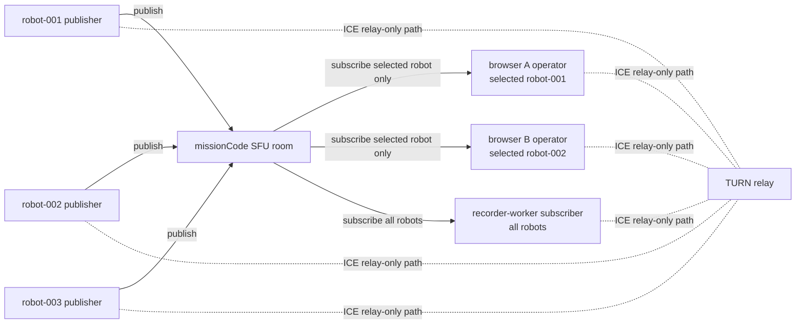

# WebRTC SFU Topology Harness

이 문서는 현재 시험으로 확인한 WebRTC 송/수신 흐름 구조만 정의한다.

구체적인 JSON 포맷, DataChannel 포맷, track 이름, codec 정책은 이 문서에서 정의하지 않는다.

## 목적

Robot, Browser, Recorder가 같은 WebRTC room에서 어떤 방향으로 연결되는지 고정한다.

현재 harness 기준 room은 mission 단위이며, room id는 `missionCode`를 사용한다.

이 문서의 현재 기준 구조는 다음이다.

```text
missionCode room
  publishers: robot-001 / robot-002 / robot-003
  subscribers: browser A / browser B / recorder-worker
```

현재 내부 PoC 기준에서 Robot은 mission room에 한 번만 publish 한다. Browser operator는 같은 mission room에 들어오되 화면에서 선택한 robotCode 하나만 subscribe 대상으로 요청한다. Recorder는 같은 mission room에 recorder subscriber로 들어와 robotCode 전체를 subscribe 한다.

Selective subscribe signaling은 내부 PoC 검증을 위한 임시 동작이다. 장기 계약으로 고정하지 않으며, 공개 API/schema, 장기 signaling message contract, 외부 연동 계약으로 해석하지 않는다.

현재 PoC/시연 기준은 TURN relay-only다.

```text
Robot / Browser / Recorder
-> TURN relay
-> WebRTC peer connection path
```

TURN은 모든 peer connection의 ICE relay 경로로 사용한다. 다만 TURN은 fan-out 서버가 아니고, 저장 서버도 아니다.

## 역할

| 역할 | 책임 |
| --- | --- |
| Robot publisher | `missionCode` room에 WebRTC media/data를 publish |
| app-server internal Pion SFU room | 같은 mission room의 publisher 입력을 subscriber 선택 범위에 맞게 fan-out |
| Browser operator subscriber | live 관제 화면용으로 mission room에 subscribe하고 선택한 robotCode만 수신 |
| Recorder subscriber | 저장용으로 mission room의 모든 robotCode를 subscribe |
| TURN relay | relay-only ICE 경로 제공 |

## 확정된 연결 구조



## 연결 순서

1. Mission room이 준비된다.
2. app-server가 `missionCode` room id를 만든다.
3. 각 Robot publisher가 같은 mission room에 publish 연결을 만든다.
4. Browser operator subscriber A/B가 같은 mission room에 subscribe 연결을 만들고 선택한 robotCode를 요청한다.
5. Recorder subscriber가 같은 mission room에 subscribe 연결을 만들고 전체 robotCode를 요청한다.
6. app-server internal Pion SFU room은 Robot publisher들의 media/data 흐름을 Browser 선택 범위와 Recorder 전체 수신 범위에 맞게 전달한다.
7. 각 peer는 `iceTransportPolicy=relay`로 TURN relay 경로를 사용한다.

## 구조 불변 조건

- 1개 WebRTC room은 1개 `missionCode`에 대응한다.
- 같은 mission room에는 2대 이상의 Robot publisher가 동시에 들어올 수 있어야 한다.
- Robot별 식별은 room id가 아니라 publisher identity와 payload/storage metadata의 `robotCode`로 유지한다.
- Browser는 room의 subscriber다.
- Recorder는 room의 subscriber다.
- Robot은 같은 mission room에 한 번만 publish 하고, Browser/Recorder 수신자 수만큼 중복 publish 하지 않는다.
- Browser operator는 현재 내부 PoC 기준으로 선택한 robotCode 하나만 subscribe 한다.
- Browser operator A와 Browser operator B는 같은 mission room에서 서로 다른 robotCode를 선택할 수 있다.
- Recorder는 같은 mission room의 robotCode 전체를 subscribe 한다.
- Browser와 Recorder는 서로 직접 연결하지 않는다.
- Recorder는 Robot에 직접 저장 요청을 보내는 구조가 아니다.
- TURN은 WebRTC 연결 경로를 보조할 뿐, media fan-out 책임을 갖지 않는다.
- relay-only 정책이므로 TURN 장애는 WebRTC 연결 장애로 취급한다.
- Recorder 장애는 Browser live 관제를 중단시키지 않아야 한다.
- Browser 장애는 Recorder 저장을 중단시키지 않아야 한다.

## 현재 테스트로 확인한 사항

아래 사항은 구조 수준에서 확인됐다.

- Robot 역할 peer가 mission room에 publish 하는 흐름
- Browser 역할 peer가 mission room에서 live 수신하는 흐름
- Recorder 역할 peer가 mission room에서 저장용 수신을 수행하는 흐름
- Robot publisher가 subscriber 수와 무관하게 한 번만 publish 하는 구조
- Browser operator subscriber가 선택한 robotCode만 수신하는 내부 PoC selective subscribe 흐름
- Recorder subscriber가 같은 mission room의 모든 robotCode를 수신하는 흐름
- TURN relay-only 경로에서 WebRTC 연결이 성립하는 흐름
- Recorder subscriber가 media/data 흐름을 받아 저장 파이프라인으로 넘기는 흐름

다중 Robot publisher가 같은 mission room에 동시에 붙는 검증 기준은 `docs/stable/harness/20260523-multi-robot-sfu-checklist.md`에 둔다.

## 현재 harness 기준 구현 대상

현재 rebuild 계열의 `/sfu/ws`는 단순 signaling relay만이 아니라 app-server 내부 Pion 기반 media fan-out을 포함한다.

mission 단위 multi-robot harness에서 검증할 구조:

```text
robot-001 / robot-002 / robot-003
-> app-server internal Pion SFU mission room
-> browser A / browser B selected robot subscribe
-> recorder-worker all robot subscribe
```

구현에서 포함해야 하는 책임:

- Robot publisher offer 수신과 server answer 반환
- Robot publisher remote track을 subscriber로 fan-out
- subscriber peer connection 생성
- Browser operator subscriber로 선택 robotCode RTP forward
- Recorder subscriber로 전체 robotCode RTP forward
- subscriber 쪽 sensor/telemetry DataChannel 생성
- Robot DataChannel message를 subscriber 선택 범위에 맞게 relay
- subscriber RTCP feedback을 Robot peer connection으로 전달

## 장기 목표 구조

장기 목표 구조는 다음이다.

```text
Robots publish once into mission room
-> SFU media router
-> Browser operator subscriber selected stream
-> Recorder subscriber all streams
```

현재 구현은 P0 검증용 app-server 내부 Pion fan-out이다. selective subscribe signaling은 내부 PoC 임시 동작으로만 둔다. 장기적으로는 더 명확한 SFU session lifecycle, subscriber 재협상 안정화, subscription API/schema 계약, 실제 수신 metadata 기록 정책을 별도 검증 항목으로 둔다.

## 이 문서에서 정의하지 않는 항목

아래 항목은 의도적으로 정의하지 않는다.

- signaling JSON message type
- offer/answer wrapper schema
- ICE candidate JSON schema
- selective subscribe request/response schema
- DataChannel 이름과 개수
- DataChannel payload envelope
- media track 이름과 개수
- track metadata format
- codec, bitrate, resolution, framerate
- stream id, track id, msid 규칙
- manifest/replay schema

이 항목들은 이 harness 문서의 범위 밖이며, 필요할 때 별도 문서나 schema로 정의한다.
